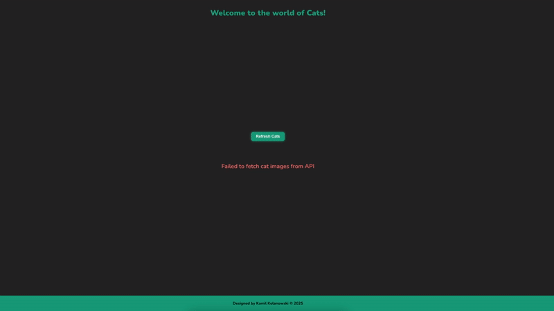
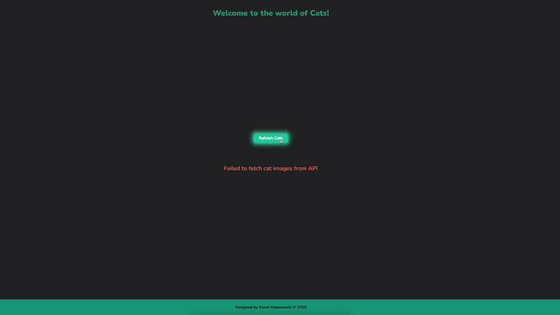

# React & C# Cat Image Gallery

This project is a full-stack application built with React (frontend) and C# with ASP.NET Core (backend). It integrates with the [Cat API](https://thecatapi.com/) to retrieve random cat images, stores the image URLs in a SQLite database using Entity Framework Core (EF Core), and displays the images in a user-friendly gallery.

## API Not Running


## API Running


## Cats Gallery


## Features

- **Frontend:** React app to browse and display cat images.
- **Backend:** C# ASP.NET Core Web API for communicating with the Cat API and serving data to the frontend.
- **Database:** SQLite database for persisting image URLs, accessed and managed via EF Core.
- **API Integration:** Calls the Cat API to fetch random cat images.
- **Persistence:** Stores each retrieved image URL in the database to avoid duplicates and enable browsing history.

## Architecture

```
React (Frontend)
   |
   | REST API calls
   v
ASP.NET Core Web API (Backend) ----> Cat API (External)
   |
   v
SQLite Database (via EF Core)
```

## Getting Started

### Prerequisites

- [.NET 7+ SDK](https://dotnet.microsoft.com/download)
- [Node.js](https://nodejs.org/en/) & [npm](https://www.npmjs.com/)
- [SQLite](https://www.sqlite.org/index.html) (optional, DB file is auto-generated)

### Backend Setup (C# ASP.NET Core)

1. **Clone the repository**

    ```sh
    git clone https://github.com/KamilKolanowski/CatImagesFetcher.git
    cd cat-gallery/backend
    ```

2. **Configure Database and Cat API**

    - The connection string for SQLite is set in `appsettings.json`.
    - Register for a (free) Cat API key at [thecatapi.com](https://thecatapi.com/) and add it to your environment configuration in secrets.json
        - Run dotnet user-secrets init (if not already done)
        - Add configuration:
            ```json
            {
                "ApiSettings": {
                    "ApiKey": "YOUR_API_KEY",
                    "BaseUrl": "https://api.thecatapi.com/v1/"
                }
            }
            ```

3. **Apply EF Core Migrations**

    ```sh
    dotnet ef database update
    ```

4. **Run the Backend**

    ```sh
    dotnet run
    ```

### Frontend Setup (React)

1. **Navigate to the frontend directory**

    ```sh
    cd ../cats-web
    ```

2. **Install dependencies**

    ```sh
    npm install
    ```

3. **Run the Frontend**

    ```sh
    npm start
    ```

### Usage

- Run the API first, and make sure it's active.
- Visit `http://localhost:3000` to access the frontend.
- Click "Refresh Cats" to retrieve a new random cat image.
- The image and its URL are stored in the database and displayed in a gallery view.

## Technologies Used

- **Frontend:** React, CSS
- **Backend:** C#, ASP.NET Core, EF Core, REST API
- **Database:** SQLite
- **External API:** [The Cat API](https://thecatapi.com/)


## Example REST Endpoint

- **GET** `/api/cats` - Retrieve list of stored cat images

## Credits

- [The Cat API](https://thecatapi.com/) for providing awesome cat images!